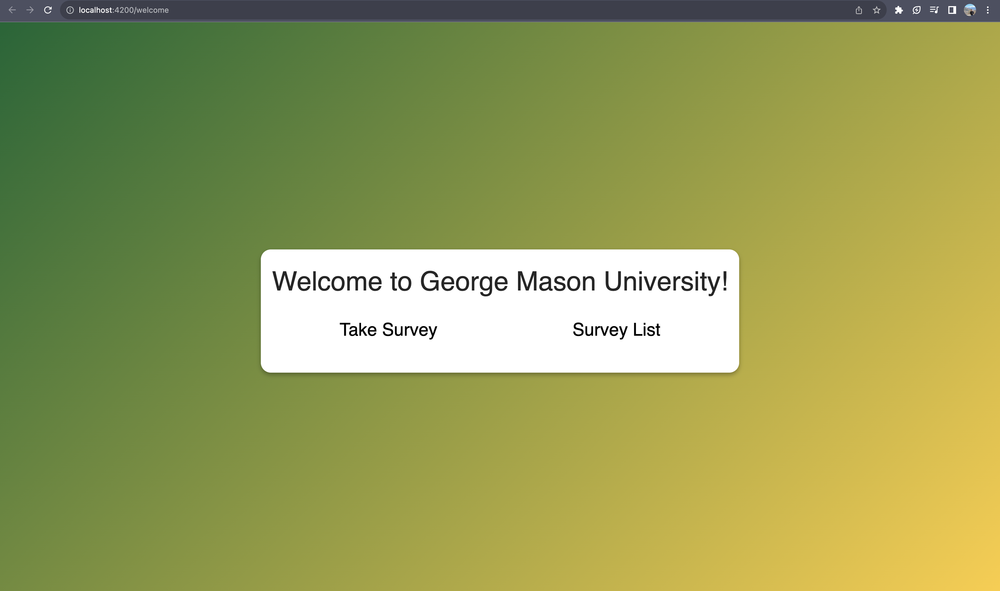
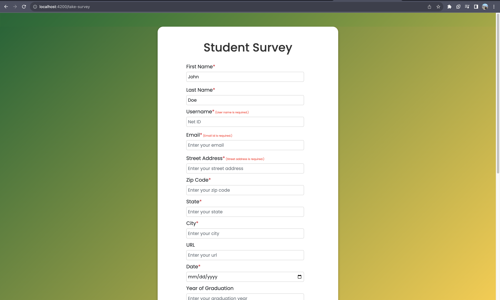
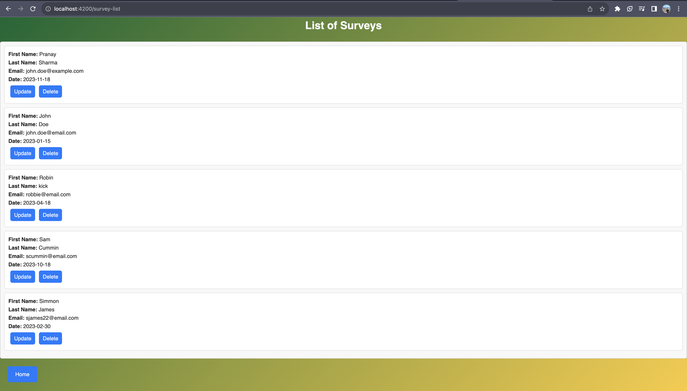

# Full Stack Application Report

### Introduction

This report provides a detailed overview of a full stack application developed with AngularJS as the frontend framework and Java Spring Boot as the backend framework. The application uses a MySQL database for performing CRUD (Create, Read, Update, Delete) operations through the Java Persistence API (JPA).

### **Frontend: AngularJS**

The frontend of the application is built using AngularJS, a JavaScript-based framework for building dynamic web applications.

**Initial Setup**

- Node.js runtime environment
- AngularJS framework
- Angular CLI for project scaffolding and build
- Visual Studio Code editor

**Key Components**

The application consist of various components to serve the different parts of the task.

1. Welcome Component: 
    - Provides options to fill out a survey form or view a list of submitted surveys
2. Survey Form Component: 
    - Form with validations to capture all required survey details. Makes API call to save data.
3. Survey List Component: 
    - Calls API to retrieve all surveys and display them with options to delete or update each one.
    - Update functionality parses form data and updates the database upon submission.
    - Delete operation updates the screen and removes the form data from the database.

**Screenshots**

### **Backend: Spring Boot**

The backend was created with Spring Boot framework written in Java connecting to a MySQL database using JPA for object-relational mapping.

**Initial Setup**

- Java Development Kit (JDK): Ensure JDK 8 or later is installed on the server.
- Integrated Development Environment (IDE): Use an IDE like IntelliJ or Eclipse for a better  experience.

**Key APIs**

1. Save Form API (`/saveform`):
    - Accepts a **`SurveyForm`** entity request and persists the new record in the database.
2. Get All Surveys API (`/getall`):
    - Returns a list of all survey forms stored in the database.
3. Delete Survey API (`/deletesurvey/{id}`):
    - Accepts the form ID as a path variable, checks for the presence of the record, and deletes it.
4. Get Form API (`/getform/{id}`):
    - Accepts the form ID as a path variable, retrieves and returns the form data as a **`SurveyForm`** POJO.
5. Update Form API (`/updateform/{id}`):
    - Accepts form data as the request body and the form ID as a path variable.
    - Updates the existing record in the database.

**Screenshots**

### **Running the Application**

Backend Spring Boot app will run on port 8081 and the frontend Angular app will be served on the port 4200. The applications interact via the exposed APIs listed above.

### **Conclusion**

In summary, the frontend and backend applications seamlessly integrated to provide a user-friendly interface for student survey. The use of MySQL as the database ensure the data is persisted and handled efficiently. The application is light weight, modular and scalable for future enhancements.

### Team Members

- Pranay Sharma 
- Ali Mohiuddin 
- Nishad Main 
- Radhika Bilolikar 
