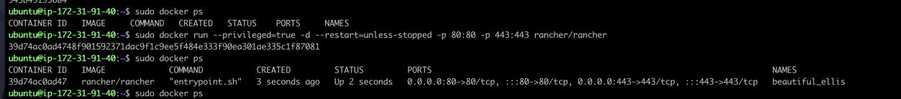

# Full Stack Application Report

### **Frontend: AngularJS**

The frontend of the application is built using AngularJS, a JavaScript-based framework for building dynamic web applications.

**Initial Setup**

- Node.js runtime environment
- AngularJS framework
- Angular CLI for project scaffolding and build
- Visual Studio Code editor

**Key Components**

The application consist of various components to serve the different parts of the task.

1. Welcome Component: 
    - Provides options to fill out a survey form or view a list of submitted surveys
2. Survey Form Component: 
    - Form with validations to capture all required survey details. Makes API call to save data.
3. Survey List Component: 
    - Calls API to retrieve all surveys and display them with options to delete or update each one.
    - Update functionality parses form data and updates the database upon submission.
    - Delete operation updates the screen and removes the form data from the database.

**Screenshots**

### **Backend: Spring Boot**

The backend was created with Spring Boot framework written in Java connecting to a MySQL database using JPA for object-relational mapping.

**Initial Setup**

- Java Development Kit (JDK): Ensure JDK 8 or later is installed on the server.
- Integrated Development Environment (IDE): Use an IDE like IntelliJ or Eclipse for a better  experience.

**Key APIs**

1. Save Form API (`/saveform`):
    - Accepts a **`SurveyForm`** entity request and persists the new record in the database.
2. Get All Surveys API (`/getall`):
    - Returns a list of all survey forms stored in the database.
3. Delete Survey API (`/deletesurvey/{id}`):
    - Accepts the form ID as a path variable, checks for the presence of the record, and deletes it.
4. Get Form API (`/getform/{id}`):
    - Accepts the form ID as a path variable, retrieves and returns the form data as a **`SurveyForm`** POJO.
5. Update Form API (`/updateform/{id}`):
    - Accepts form data as the request body and the form ID as a path variable.
    - Updates the existing record in the database.

**Screenshots**

### **Running the Application**

Backend Spring Boot app will run on port 8081 and the frontend Angular app will be served on the port 4200. The applications interact via the exposed APIs listed above.

### **Deploying the code on AWS**

1. Push all the existing code to a GitHub repo.

2. Create a DockerHub Repo and push your latest image.
(Docker run & build –
docker build -t surveyformcd .
docker run -p 8080:8080 surveyformcd
Docker tag & push -
docker tag surveyformcd:latest docker.io/surveyformcd:latest
docker login docker.io
docker push pranaysharma793/surveyformcd:latest)

3. Log on to your free-tier AWS account via Learner Lab. From here we would be creating our 
CI-CD pipeline using Rancher and Jenkins.
- To begin with create, 3 EC2 instances, one would be our Rancher server, the second 
would be for the Kubernetes cluster and the third will be the Jenkins instance

4. We begin with the first instance, which is the Rancher server. Connect to this server and
install docker in this instance using the following commands:
- Update: sudo apt-get update
- Install Docker: sudo apt install docker.io
- Check docker version once installed: docker –v
Once docker is installed, we download rancher using the command:
- sudo docker run --privileged=true -d --restart=unless-stopped -p 80:80 -p 443:443 
rancher/rancher

5. Once Rancher is successfully started, create a custom Cluster. 

6. Next you need to register the etcd, the control plane and the worker node on the second EC2 instance which was created for the kubernetes cluster as mentioned earlier. To do this, run the command obtained above (while creating the custom cluster) by logging into the second EC2 instance as shown below.

7. . Once it is created, you can see the created k8cluster as `Active`.

8. Deploy the Docker images in the newly created K8s cluster.

9. Using the `kubectl get all` command, we can see that the pods are in the running state and ready.

10. We can now access our form using the TCP url of this pod

11. Install Jenkins in the third EC2 instance.

12. Create a build pipeline

13. Next, come the Jenkins UI which shows the various stages of the Pipeline.
- Here to test the working of the pipeline, with any change push the github repo a new build is triggered and the image is updated.

14. Now, check your survey-form url. You will see that the changes you have made have been reflected in the latest build. This demonstrate the complete working of our pipeline.

#### References:

Setting up git in Eclipse:
https://www.geo.uzh.ch/microsite/reproducible_research/post/rr-eclipse-git/
Building docker image from the war file:
https://aspetraining.com/resources/blog/deploying-your-first-web-app-to-tomcat-on-docker
To push docker image into the docker hub:
https://ropenscilabs.github.io/r-docker-tutorial/04-Dockerhub.html
Setting up Jenkins: https://pkg.jenkins.io/debian/
Pipeline in Jenkins: https://www.guru99.com/jenkins-pipeline-tutorial.html